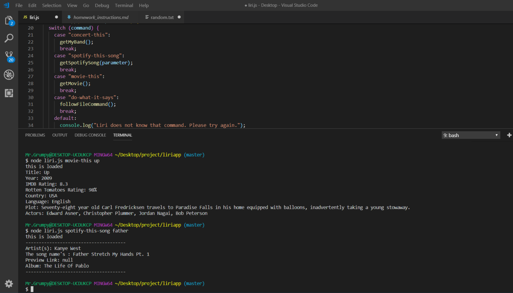

# liriapp

LIRI is a _Language_ Interpretation and Recognition Interface. LIRI will be a command line node app that takes in parameters and gives you back data. LIRI will search Spotify for songs, Bands in Town for concerts, and OMDB for movies. Liri need to send requests using the `axios` package to the Bands in Town, Spotify and OMDB APIs. Then sent it back the data.

# API use

   * [Node-Spotify-API](https://www.npmjs.com/package/node-spotify-api)

   * [Axios](https://www.npmjs.com/package/axios)

   * [OMDB API](http://www.omdbapi.com) and the 
   
   * [Bands In Town API](http://www.artists.bandsintown.com/bandsintown-api)

   * [Moment](https://www.npmjs.com/package/moment)

   * [DotEnv](https://www.npmjs.com/package/dotenv)
   
# Screen capture

 
# Github project

https://nan227.github.io/liriapp/

# Video

https://youtu.be/DYDXJXcJUig
